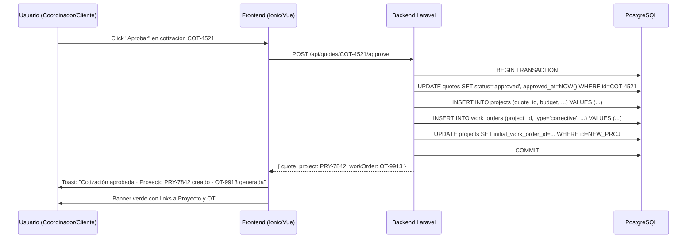

# Documento de Requerimientos del Sistema (PRD) – CMMS SaaS “ProMaintenance”

## 1. Visión General del Sistema y Modelo SaaS

El sistema será una plataforma CMMS bajo el modelo **SaaS (Software as a Service) Multi-Tenant**. Esto significa que una única instancia de la aplicación servirá a múltiples empresas clientes (Tenants), garantizando el aislamiento absoluto de los datos entre ellas mediante una estrategia de *Single Database con Tenant ID Isolation* (Filtro por columna `tenant_id` en todas las consultas).

### 1.1 Stack Tecnológico Definido
- **Backend:** **Laravel** (Última versión estable), actuando como una API RESTful centralizada y robusta. Manejará la autenticación (Laravel Sanctum), colas de procesos para integración con pasarelas de mensajería, control de accesos y la sincronización global.
- **Frontend (Web & Mobile):** **Ionic Framework con Vue.js**, empaquetado y distribuido mediante **Capacitor**. Esto garantiza un código único para la aplicación web responsiva y las aplicaciones móviles nativas (Android/iOS).
- **Base de Datos Central (Cloud):** Base de datos relacional gestionada en producción (ej. PostgreSQL o MySQL) conectada a Laravel.
- **Base de Datos Local (Dispositivo/Cliente):** **SQLite** embebido en la aplicación móvil/web mediante los plugins nativos de Capacitor (ej. `capacitor-sqlite`). Esta base de datos replicará el esquema necesario para operar de forma local.

---

## 2. Arquitectura de Usuarios, Roles y Seguridad

### 2.1 Jerarquía de Accesos
- **Super Usuario (System Admin / Maestro):** Usuario global del SaaS. Administra los Tenants (empresas cliente), planes, suscripciones, configuraciones maestras globales y soporte técnico. Inmodificable y único para los desarrolladores del sistema.
- **Administrador del Tenant (Tenant Admin):** Dueño de la cuenta de la empresa cliente. Puede crear usuarios internos, asignar roles, configurar flujos de trabajo específicos de su empresa a través de sus ajustes de Tenant y ver las finanzas completas de su organización.
- **Coordinador/Supervisor de Proyecto:** Gestiona proyectos, asigna órdenes de trabajo (OT), recursos (empleados/equipos), supervisa métricas de cumplimiento y gestiona compras/inventario.
- **Trabajador / Técnico de Campo:** Perfil optimizado para la app móvil en Ionic/Capacitor. Completa checklists de seguridad, registra horas, reporta consumo de materiales, traslados, almacena evidencia, reporta avances de tareas y opera de manera offline sobre SQLite local.

### 2.2 Seguridad, Auditoría y Cumplimiento
- **RBAC (Role-Based Access Control):** Control de acceso basado en roles con permisos granulares (Crear, Leer, Actualizar, Eliminar - CRUD).
- **Módulo de Auditoría (Activity Log):**
    - Registro en tiempo real de acciones críticas (ej. creación de OTs, cambios de presupuesto, transacciones de inventario, aprobación de checklists de seguridad, login).
    - Estructura del log: `ID_Usuario`, `Acción`, `Entidad_Afectada`, `Timestamp`, `Valor_Anterior`, `Valor_Nuevo`, `Geolocalización` (capturada de forma nativa por Capacitor).

---

## 3. Módulos del Sistema (Requerimientos Funcionales)

### 3.1 Módulo de Clientes, Cotizaciones y Portal Externo (con SLAs)
- **Gestión de Clientes (CRM Básico):** Registro de datos fiscales, contactos, direcciones y vinculación uno-a-muchos con Proyectos.
- **Acuerdos de Nivel de Servicio (SLA):** Parámetros contractuales vinculados al cliente o proyecto para definir los Tiempos Máximos de Respuesta y Tiempos de Resolución permitidos según la criticidad de la falla (Alta, Media, Baja). El sistema disparará alertas visuales si una OT está próxima a vencer su SLA.
- **Motor de Cotizaciones:**
    - Generación de cotizaciones basadas en costos estimados de mano de obra, uso de equipos, materiales e ítems logísticos.
    - Cálculo automático de subtotales, impuestos configurables y total general.
    - **Compartición Omnicanal:** Generación de PDF dinámico y envío automatizado vía Webhooks/APIs para WhatsApp Business, SMTP (Email) y pasarelas de SMS.
- **Portal del Cliente:** Acceso limitado, seguro y gratuito para los clientes finales de cada Tenant. Permite visualizar de forma exclusiva el avance de sus proyectos, verificar el cumplimiento de los SLAs contratados, aprobar o rechazar cotizaciones emitidas y descargar facturas históricas o informes de cierre de OTs.

### 3.2 Módulo de Proyectos, Órdenes de Trabajo (OT) y Tareas
Para garantizar que la IA entienda la jerarquía y los cálculos financieros en cascada, se define la siguiente estructura:

`[Cliente] ──> [Proyecto] ──> [Órdenes de Trabajo (OT)] ──> [Tareas]`

- **Proyectos:** - Atributos: Nombre, Fechas, Presupuesto Asignado, Costo Adicional del Proyecto.
    - *Métrica Calculada:* $\text{Costo Total Proyecto} = \sum(\text{Costos OTs}) + \text{Costos Adicionales Proyecto}$.
- **Órdenes de Trabajo (OT):** - Atributos: Clasificación (Correctiva / Preventiva), Prioridad, Estado (Pendiente, En Proceso, Detenida, Completada), Costo Fijo de la OT (si aplica), Costo de Traslado/Logística (Combustible, viáticos de traslado al sitio del cliente), Costo Adicional de la OT.
    - *Métrica Calculada:* $\text{Costo Total OT} = \sum(\text{Costos Tareas}) + \text{Costo Fijo OT} + \text{Costo de Traslado} + \text{Costos Adicionales OT}$.
- **Tareas:**
    - Atributos: Descripción, Estado, Costos Adicionales de la Tarea.
    - *Métrica Calculada (Incluye Recursos e Inventario):* $$\text{Costo Total Tarea} = (\text{Horas Trabajador} \times \text{Tarifa Hora}) + (\text{Horas Equipo} \times \text{Tarifa Uso}) + \sum(\text{Cantidad Material} \times \text{Costo Unitario}) + \text{Costos Adicionales Tarea}$$

### 3.3 Módulo de Recursos: Empleados y Equipos (con Logística de Traslado)
- **Gestión de Trabajadores:** Perfil con datos personales, rol y asignación de una **Tarifa por Hora Laborada** (estándar y horas extra).
- **Gestión de Equipos (Activos):** Registro de maquinaria (soldadoras, cortadoras, etc.). Cada equipo posee una **Tarifa de Costo de Operación por Hora** y un campo para indicar si se encuentra bajo **Garantía de Proveedor** (bloqueando costos de reparación si está activa).
- **Módulo de Logística y Traslado:** Formulario para registrar el kilometraje inicial/final de los vehículos de la empresa, consumo de combustible y viáticos asociados directamente al traslado de cuadrillas y equipos hacia una OT.
- **Time Tracking (Hojas de Tiempo):** Los trabajadores pueden iniciar/detener un temporizador (Check-in / Check-out) en Ionic asociado a una Tarea específica, siempre y cuando cumplan con las validaciones previas de seguridad.

### 3.4 Módulo de Mantenimiento Preventivo y Predictivo
- **Planes de Mantenimiento Programado:** Motor de automatización para programar OTs repetitivas basadas en:
    - *Tiempo:* Frecuencias fijas parametrizables (ej. cada 30 días).
    - *Uso/Métricas:* Activación por umbrales basados en el uso real del equipo acumulado en las tareas (ej. cada 100 horas de operación).
- **Alertas de Próximos Mantenimientos:** Sistema de alarmas automáticas enviadas al panel del administrador y correo electrónico cuando un activo esté próximo a cumplir su ciclo para prevenir fallas operativas.

### 3.5 Módulo de Inventario y Almacén (Repuestos y Materiales)
- **Catálogo de Repuestos y Consumibles:** Registro maestro de stock indexado por identificadores únicos, códigos de barra y códigos QR, incluyendo ubicación física en almacén, costo unitario promedio ponderado y estatus de **Garantía de Fábrica** por lote/pieza.
- **Asociación de Materiales a Tareas:** Interfaz para que el técnico de campo reporte el consumo de insumos (ej. discos de corte, electrodos) directamente en la tarea. El sistema realiza la deducción automatizada del inventario y el recargo inmediato en el costo de la tarea.
- **Alertas de Stock Mínimo:** Disparadores lógicos que notifican al administrador de compras cuando las existencias caigan por debajo del Stock de Seguridad configurado por artículo.

### 3.6 Módulo de Proveedores y Órdenes de Compra
- **Registro de Proveedores:** Base de datos de talleres externos, subcontratistas y proveedores de materiales o insumos.
- **Gestión de Órdenes de Compra:** Flujo de abastecimiento que permite emitir órdenes de compra directamente cuando un repuesto para una OT esté agotado o se requiera un servicio externo, vinculando contablemente el costo de la factura directamente al proyecto afectado.

### 3.7 Módulo de Configuraciones (Settings) en Dos Niveles
- **Panel de Configuración Global (Super Admin):** Panel exclusivo donde el Super Administrador del SaaS puede definir parámetros operativos restrictivos para cada Tenant de manera individual (ej. Límite máximo de almacenamiento de archivos, número máximo de usuarios permitidos en el plan, activación/desactivación de módulos específicos como el de Inteligencia Artificial o las funciones avanzadas de logística).
- **Panel de Configuración del Tenant (Tenant Admin):** Espacio dentro de la empresa cliente donde el Administrador de ese Tenant ajusta sus operaciones (ej. Definición del huso horario local, configuración de impuestos corporativos por defecto para sus cotizaciones, personalización de prefijos/foliolados para las OTs, parametrización de las preguntas de los Checklists de Seguridad Obligatorios y subida de su logotipo empresarial).

### 3.8 Módulo de Multimoneda y Conversión Cambiaria (BCV)
- **Soporte de Monedas:** El sistema operará de forma nativa con transacciones, costos, presupuestos y cotizaciones expresadas en **Dólares (USD)**, **Euros (EUR)** y **Bolívares (VES)**.
- **Integración con Tasas Oficiales (BCV):** El Backend en Laravel contará con un servicio (Task Scheduler/Cron Job) encargado de realizar Web Scraping o consumir una API confiable para extraer diariamente las tasas de cambio oficiales publicadas por el **Banco Central de Venezuela**. Estas tasas se almacenarán centralizadamente en la base de datos con marcas de tiempo históricas.
- **Motor de Conversión:** Capacidad de transformar cualquier monto financiero (Costo de tarea, logística de traslado, cotización al cliente, balance general) entre las tres monedas en tiempo real utilizando la tasa oficial registrada a la fecha de la transacción.

---

## 4. Requerimientos No Funcionales y UI/UX

### 4.1 Estrategia Offline-First con SQLite e Ionic
Dado que los técnicos suelen trabajar en zonas sin conectividad (talleres blindados, campo abierto), el sistema implementará:
- **Almacenamiento Local (SQLite):** Mediante el plugin de almacenamiento nativo de Capacitor, la app Ionic mantendrá una réplica exacta del catálogo de activos, inventario actual, tareas asignadas, checklists de seguridad parametrizados y logs de tiempo en el archivo SQLite del dispositivo móvil.
- **Sincronización Bidireccional:** Al detectar reconexión a Internet mediante la API de red de Capacitor Network, un servicio en segundo plano sincronizará los datos enviando las colas de peticiones acumuladas en el SQLite hacia la API de Laravel utilizando marcas de tiempo robustas para la resolución de conflictos (*Last-Write-Wins* modificado por jerarquía de rol).

### 4.2 Interfaces, Dashboards y Optimización de Campo
El frontend se desarrollará en Ionic con componentes basados en Vue.js optimizados para respuestas ágiles bajo la filosofía Mobile-First.

- **Optimización UI/UX para Técnicos (Mobile):**
    - **Interacción por Códigos QR:** Escaneo nativo por medio de Capacitor Camera sobre las etiquetas físicas de las máquinas. Al escanear, lee el identificador y despliega en Ionic el historial de fallas, manuales y accesos para abrir OTs o iniciar *time tracking* en SQLite local.
    - **Módulo Obligatorio HSE / AST (Checklist de Seguridad):** Antes de permitir que el técnico inicie el temporizador (*time tracking*) de una tarea, la app de Ionic desplegará un checklist obligatorio de Seguridad Industrial y Análisis de Riesgo en el Trabajo (ej. *"¿Tiene careta de soldar?"*, *"¿Entorno libre de gases inflamables?"*). El botón de inicio permanecerá bloqueado hasta marcar todos los puntos requeridos.
    - **Captura de Evidencia Fotográfica y Firmas:** Carga de imágenes guardadas temporalmente en el sistema de archivos del celular ("Antes" y "Después") junto con la recolección de la firma digital en pantalla del técnico y del cliente para proceder al cierre.
    - **Dictado de Reportes por Voz con IA:** Envío de archivos de audio procesados en el backend de Laravel a través de APIs de transcripción de IA para estructurar el reporte técnico automáticamente.
- **Panel de Control Operativo (Dashboard en Tiempo Real):**
    - Monitoreo visual del progreso de proyectos mediante diagramas de Gantt o tableros Kanban dinámicos.
    - Panel de control de **Métricas de SLAs** con alertas de semáforo (Verde, Amarillo, Rojo) para evitar penalizaciones por retraso con los clientes.
    - Indicadores y logs en tiempo real (vía WebSockets/Laravel Echo) de la actividad de los usuarios y estados de las OTs.
    - **Notificaciones Push:** Despacho inmediato mediante Firebase Cloud Messaging (FCM) integrado en Capacitor a los dispositivos de los técnicos ante asignaciones de emergencia.
- **Generación Automatizada de Informes de Cierre (PDF):** Al completarse una OT, el backend de Laravel unificará los datos de costos, materiales consumidos, horas hombre trabajadas, las respuestas del checklist de seguridad, la evidencia fotográfica y las firmas digitales recopiladas, estructurándolas de forma automática en un reporte técnico en PDF descargable y listo para enviar al cliente.
- **Panel Financiero (Centro de Costos):**
    - Métricas clave (KPIs) en tarjetas de resumen: **Total Gastado (incluyendo logística e inventario)**, **Pendiente por Pagar**, **Total Pagado**, **Saldo/Margen de Ganancia Actual**.
    - Capacidad de conmutar visualmente todo el balance entre USD, EUR o VES en un solo clic usando las tasas del BCV vigentes.

---

## 5. Matriz de Entidades y Relaciones (Para diseño de Base de Datos)

Para facilitar que la IA genere el código SQL o los modelos de ORM en Laravel (Eloquent), se definen las siguientes relaciones incluyendo el campo mandatorio `tenant_id`:

- **Tenants:** `1` a `N` con `Usuarios`, `Clientes`, `Proyectos`, `Equipos`, `Materiales`, `Proveedores` y `Tenant_Settings`.
- **Global_Settings:** `1` a `1` con cada `Tenant` (Definido exclusivamente por el Super Admin).
- **Bcv_Rates:** Tabla histórica global indexada por fecha con campos `usd_to_ves`, `eur_to_ves`.
- **Clientes:** `1` a `N` con `Proyectos`, `Cotizaciones` y `Slas_Config`.
- **Proyectos:** `1` a `N` con `Ordenes_Trabajo` y `Ordenes_Compra`. Cada transacción registra la `moneda_iso` de origen.
- **Ordenes_Trabajo:** `1` a `N` con `Tareas`, `Planes_Mantenimiento`, `Logistica_Traslados` e `Informes_Cierre_Pdf`.
- **Tareas:** - `N` a `M` con `Usuarios` (Trabajadores) vía `Time_Logs_Trabajadores`.
    - `N` a `M` con `Equipos` via `Time_Logs_Equipos`.
    - `1` a `1` con `Checklists_Seguridad_Hse` (asociado al log de inicio).
    - `1` a `N` con `Consumo_Materiales` (registra cantidad consumida y descuenta de `Materiales`).
- **Materiales:** `N` a `1` con `Proveedores` e indexado con tablas de inventario básico.

---

## 6. Flujo de Aprobación de Cotización → Proyecto + OT Inicial (Ampliación)

> ⚠️ **Requerimiento adicional** identificado durante el desarrollo del frontend (no estaba en el PRD original v1). Se documenta aquí para que el backend Laravel lo implemente de forma equivalente.

### 6.1 Comportamiento esperado

Cuando una cotización cambia de estado a `approved`, el sistema debe **crear atómicamente** dos entidades hijas y mantener la trazabilidad:

1. **Proyecto** — copia la información financiera de la cotización
2. **Orden de Trabajo inicial** — primera OT del proyecto recién creado

Esta operación es **idempotente**: si por error se hace doble click, no se duplican proyectos ni OTs.

### 6.2 Estados de la cotización y transiciones

| Estado actual | Acción | Estado resultante | Efecto colateral |
|---------------|--------|------------------|-------------------|
| `draft` | Aprobar | `approved` | Crear Proyecto + OT inicial |
| `sent` | Aprobar | `approved` | Crear Proyecto + OT inicial |
| `draft` / `sent` | Rechazar | `rejected` | Ninguno (solo cambia status, nota opcional) |
| `approved` | Aprobar | `approved` | **No-op** (retorna hijos existentes) |
| `approved` | Rechazar | (sin cambio) | No se puede rechazar una aprobada |
| `rejected` | Aprobar | (sin cambio) | No se puede aprobar una rechazada |
| `expired` | Aprobar/Rechazar | (sin cambio) | Bloqueada |

### 6.3 Datos que se copian al Proyecto

| Campo del Proyecto | Origen |
|--------------------|--------|
| `tenantId` | De la cotización |
| `clientId` | De la cotización |
| `name` | Primer ítem tipo `labor` de la cotización, o primeras 60 chars de `notes`, o `Proyecto: <número cotización>` |
| `code` | Generado con el prefijo del Tenant (`PRY-XXXX`) |
| `budget` | **Total de la cotización** (subtotal × (1 + taxPercent/100)) |
| `additionalCost` | 0 |
| `currency` | Moneda de la cotización |
| `startDate` | Timestamp de aprobación |
| `status` | `planning` |
| `progress` | 0 |
| `managerId` | `createdBy` de la cotización |
| `quoteId` ⭐ | ID de la cotización origen |
| `initialWorkOrderId` ⭐ | ID de la OT inicial creada (se llena post-creación) |
| `description` | `notes` de la cotización |

### 6.4 Datos que se copian a la OT inicial

| Campo de la OT | Origen |
|----------------|--------|
| `tenantId` | De la cotización |
| `projectId` | ID del proyecto recién creado |
| `clientId` | De la cotización |
| `number` | Generado con el prefijo del Tenant (`OT-XXXX`) |
| `title` | `OT inicial — <nombre del proyecto>` |
| `description` | `notes` de la cotización |
| `type` | `corrective` |
| `status` | `pending` |
| `priority` | `medium` |
| `fixedCost` | 0 |
| `logisticsCost` | 0 |
| `additionalCost` | 0 |
| `currency` | Moneda de la cotización |
| `createdBy` | Usuario aprobador |
| `assignedUserIds` | `[]` (sin asignar) |

### 6.5 Cambios en el modelo de datos

Agregar al modelo `Project` los campos opcionales:
- `quoteId` (FK a `Quotes`, nullable)
- `initialWorkOrderId` (FK a `WorkOrders`, nullable)

Agregar al modelo `Quote` los timestamps:
- `approvedAt` (ya contemplado en el PRD original, formalizar)
- `approvedBy` (FK a `Users`)

### 6.6 Endpoints REST sugeridos (Laravel)

| Método | Ruta | Descripción |
|--------|------|-------------|
| `POST` | `/api/quotes/{id}/approve` | Aprueba y crea Proyecto + OT inicial atómicamente. Retorna `{ quote, project, workOrder }` |
| `POST` | `/api/quotes/{id}/reject` | Body: `{ reason?: string }`. Cambia status a `rejected` |
| `GET` | `/api/projects/{id}/source-quote` | Retorna la cotización origen (si existe) |

### 6.7 Flujo visual en el frontend

### 6.8 Portal del Cliente (alcance)

El mismo flujo se invoca desde el portal del cliente. La aprobación es **definitiva** (no requiere segunda confirmación del lado administrativo). El rechazo cambia el estado a `rejected` y la cotización queda archivada.

### 6.9 Restricciones e invariantes

- Si la cotización ya está `approved`, llamar al endpoint de aprobación debe ser **idempotente** (retornar los hijos existentes, no crear duplicados).
- Si la cotización está `rejected` o `expired`, no se puede aprobar ni rechazar de nuevo.
- La transacción de creación debe ser **atómica**: si falla la inserción del proyecto o la OT, se hace rollback de la cotización (vuelve a `sent` o `draft`).
- La auditoría debe registrar la acción `Aprobar` con la `previousValue: status='sent'` y `newValue: status='approved'`, más los IDs del proyecto y OT creados en el campo `entityId` (o un campo `metadata` JSON si se prefiere).

---

## ¿Cómo usar este requerimiento con una IA?

Puedes copiar este documento refinado y darle instrucciones específicas como estas:

> *"Actúa como un Desarrollador Backend Senior en Laravel. Utilizando este PRD, genera las migraciones de base de datos preparadas para multi-tenancy incluyendo la lógica de tablas para OTs, SLAs, Checklists de seguridad y logística de traslados. Implementa también el flujo de aprobación de cotización a proyecto + OT inicial (sección 6) en una transacción atómica."*
> 
> o bien...
> 
> *"Actúa como un Desarrollador Frontend Senior en Ionic y Vue 3. Genera un componente de interfaz de usuario para la app móvil utilizando Capacitor que bloquee el inicio del tracking de una tarea si el formulario del Checklist Obligatorio de Seguridad HSE no ha sido completado y firmado."*